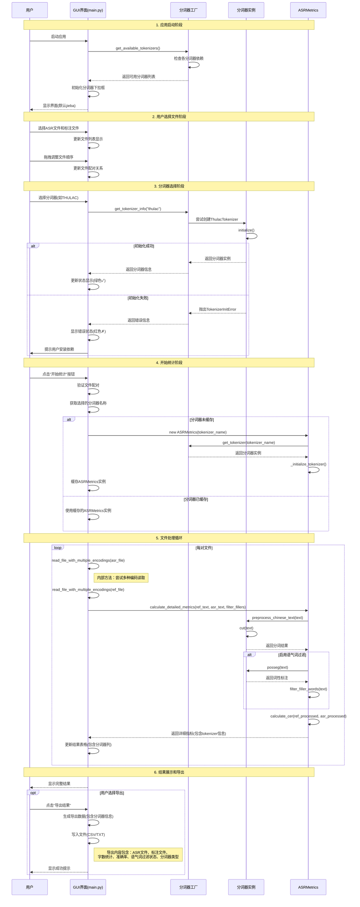

# Cer-MatchingTools-V1-架构设计文档

## 1. 系统概述

### 1.1 项目简介
ASR字准确率对比工具是一个基于Python的桌面应用程序，用于批量对比ASR（自动语音识别）转写结果与标准文本之间的字准确率（Character Error Rate, CER）。

### 1.2 设计目标
- **准确性**：提供精确的中文字符错误率计算
- **易用性**：支持GUI界面、命令行和批量处理
- **扩展性**：支持多种分词器的插拔式切换
- **性能**：高效处理大量文本数据
- **兼容性**：跨平台支持，多编码格式兼容

## 2. 系统架构

### 2.1 整体架构图
```
┌─────────────────────────────────────────────────────────────┐
│                    用户界面层                                │
├─────────────────┬─────────────────┬─────────────────────────┤
│   GUI界面        │   命令行界面      │    批处理接口            │
│  (Tkinter)      │   (Click)       │   (API)                │
└─────────────────┴─────────────────┴─────────────────────────┘
                            │
┌─────────────────────────────────────────────────────────────┐
│                   业务逻辑层                                 │
├─────────────────┬─────────────────┬─────────────────────────┤
│  文件管理模块    │   计算引擎模块   │   结果输出模块           │
│  - 文件读取     │   - CER计算     │   - 报告生成            │
│  - 编码检测     │   - 错误分析    │   - 数据导出            │
│  - 格式验证     │   - 统计分析    │   - 可视化              │
└─────────────────┴─────────────────┴─────────────────────────┘
                            │
┌─────────────────────────────────────────────────────────────┐
│                   分词器抽象层                               │
├─────────────────┬─────────────────┬─────────────────────────┤
│  分词器工厂      │   分词器接口     │   分词器管理器           │
│  - 动态检测     │   - 统一接口    │   - 生命周期管理         │
│  - 实例创建     │   - 错误处理    │   - 配置管理            │
└─────────────────┴─────────────────┴─────────────────────────┘
                            │
┌─────────────────────────────────────────────────────────────┐
│                   分词器实现层                               │
├─────────────────┬─────────────────┬─────────────────────────┤
│  Jieba分词器     │  THULAC分词器   │   HanLP分词器           │
│  - 基础分词     │   - 学术级分词  │   - 深度学习分词         │
│  - 词性标注     │   - 高精度     │   - 多任务处理          │
└─────────────────┴─────────────────┴─────────────────────────┘
                            │
┌─────────────────────────────────────────────────────────────┐
│                   数据处理层                                 │
├─────────────────┬─────────────────┬─────────────────────────┤
│  文本预处理      │   算法库集成     │   数据存储              │
│  - 编码转换     │   - Levenshtein │   - 内存管理            │
│  - 格式标准化   │   - Jiwer库     │   - 缓存机制            │
│  - 语气词过滤   │   - Pandas      │   - 临时文件            │
└─────────────────┴─────────────────┴─────────────────────────┘
```

### 2.2 核心组件说明

#### 2.2.1 用户界面层
- **GUI界面**：基于Tkinter的图形界面，提供直观的文件管理和结果展示
- **命令行界面**：基于Click的CLI工具，支持脚本化和自动化处理
- **批处理接口**：提供API接口，支持程序化调用

#### 2.2.2 业务逻辑层
- **文件管理模块**：负责文件读取、编码检测、格式验证
- **计算引擎模块**：核心算法实现，包括CER计算、错误分析
- **结果输出模块**：报告生成、数据导出、结果可视化

#### 2.2.3 分词器抽象层
- **工厂模式**：动态检测和创建分词器实例
- **统一接口**：所有分词器遵循相同的接口规范
- **错误处理**：优雅降级和异常恢复机制

#### 2.2.4 分词器实现层
- **Jieba分词器**：默认分词器，轻量级，兼容性好
- **THULAC分词器**：学术级分词，精度高
- **HanLP分词器**：基于深度学习，功能全面

## 3. 技术架构

### 3.1 技术选型

#### 3.1.1 核心技术栈
- **编程语言**：Python 3.12
- **依赖管理**：pipenv
- **GUI框架**：Tkinter (标准库)
- **CLI框架**：Click
- **数据处理**：Pandas
- **算法库**：jiwer, python-Levenshtein

#### 3.1.2 分词技术栈
- **Jieba**：轻量级中文分词库
- **THULAC**：清华大学中文分词库
- **HanLP**：哈工大NLP工具包

#### 3.1.3 开发工具
- **版本控制**：Git
- **测试框架**：pytest
- **代码风格**：遵循PEP 8，使用中文注释
- **文档格式**：Markdown

### 3.2 设计模式

#### 3.2.1 策略模式 (Strategy Pattern)
```python
class BaseTokenizer:
    """分词器基类，定义统一接口"""
    def tokenize(self, text: str) -> List[Tuple[str, int, int]]:
        pass

class JiebaTokenizer(BaseTokenizer):
    """Jieba分词器实现"""
    pass

class ASRMetrics:
    """CER计算引擎，通过策略模式使用不同分词器"""
    def __init__(self, tokenizer: BaseTokenizer):
        self.tokenizer = tokenizer
```

#### 3.2.2 工厂模式 (Factory Pattern)
```python
class TokenizerFactory:
    """分词器工厂，负责创建和管理分词器实例"""
    @staticmethod
    def create_tokenizer(tokenizer_type: str) -> BaseTokenizer:
        pass
    
    @staticmethod
    def get_available_tokenizers() -> List[str]:
        pass
```

#### 3.2.3 单例模式 (Singleton Pattern)
```python
class TokenizerManager:
    """分词器管理器，确保分词器实例的唯一性"""
    _instances = {}
    
    def get_tokenizer(self, tokenizer_type: str) -> BaseTokenizer:
        pass
```

### 3.3 模块设计

#### 3.3.1 核心模块结构
```
dev/src/
├── main_with_tokenizers.py          # 主程序入口
├── asr_metrics_refactored.py        # CER计算引擎
├── requirements.txt                 # 依赖声明
├── text_tokenizers/                 # 分词器模块
│   ├── __init__.py                  # 模块初始化
│   └── tokenizers/                  # 分词器实现
│       ├── base.py                  # 基类和异常定义
│       ├── factory.py               # 工厂类和管理器
│       ├── jieba_tokenizer.py       # Jieba分词器
│       ├── thulac_tokenizer.py      # THULAC分词器
│       └── hanlp_tokenizer.py       # HanLP分词器
└── v0.1.0/                         # 历史版本代码
```

#### 3.3.2 接口设计

**分词器接口**
```python
class BaseTokenizer(ABC):
    @abstractmethod
    def tokenize(self, text: str) -> List[Tuple[str, int, int]]:
        """
        分词并返回位置信息
        Returns: [(token, start_pos, end_pos), ...]
        """
        pass
    
    @abstractmethod
    def is_available(self) -> bool:
        """检查分词器是否可用"""
        pass
```

**计算引擎接口**
```python
class ASRMetrics:
    def __init__(self, tokenizer: BaseTokenizer):
        self.tokenizer = tokenizer
    
    def calculate_cer(self, reference: str, hypothesis: str, 
                     filter_fillers: bool = False) -> Dict:
        """计算字符错误率"""
        pass
    
    def batch_calculate(self, file_pairs: List[Tuple[str, str]], 
                       **kwargs) -> pd.DataFrame:
        """批量计算"""
        pass
```

## 4. 数据流设计

### 4.1 数据处理流程
```
文本输入 → 编码检测 → 格式标准化 → 分词处理 → CER计算 → 结果输出
    ↓          ↓           ↓          ↓         ↓         ↓
  文件读取   编码转换    文本清理    位置标记   算法计算   报告生成
```

### 4.2 错误处理流程
```
分词器检测 → 依赖验证 → 实例创建 → 功能测试 → 降级处理
     ↓          ↓         ↓         ↓         ↓
   可用性     版本兼容   初始化    接口验证   备选方案
```

## 5. 系统业务时序图

### 5.1 系统交互时序图

以下时序图详细描述了用户与系统各组件之间的完整交互流程，从应用启动到结果导出的全过程：



### 5.2 关键业务流程说明

#### 5.2.1 应用启动阶段
1. **分词器检测**：系统启动时自动检测所有可用的分词器
2. **依赖验证**：通过实例化测试验证每个分词器的依赖是否满足
3. **界面初始化**：根据可用分词器列表初始化用户界面

#### 5.2.2 分词器选择机制
1. **实时验证**：用户选择分词器时实时检查其可用性
2. **状态反馈**：通过颜色标识和文本提示显示分词器状态
3. **错误处理**：优雅处理分词器初始化失败的情况

#### 5.2.3 性能优化策略
1. **单例模式**：分词器工厂使用单例模式避免重复初始化
2. **实例缓存**：GUI层缓存ASRMetrics实例以提高性能
3. **延迟加载**：分词器按需初始化，避免不必要的资源消耗

#### 5.2.4 数据处理流程
1. **多编码支持**：自动检测和转换文件编码
2. **批量处理**：支持多文件对的批量处理
3. **结果聚合**：实时更新结果表格并支持导出

### 5.3 时序图与代码实现对应关系

| 时序图组件 | 代码实现 | 位置 |
|------------|----------|------|
| GUI界面 | `ASRComparisonTool` | `main_with_tokenizers.py` |
| 分词器工厂 | `TokenizerFactory` | `text_tokenizers/tokenizers/factory.py` |
| 分词器实例 | `BaseTokenizer`及其子类 | `text_tokenizers/tokenizers/` |
| ASRMetrics | `ASRMetrics` | `asr_metrics_refactored.py` |
| get_available_tokenizers() | `get_available_tokenizers()` | `factory.py:26-50` |
| get_tokenizer_info() | `get_tokenizer_info()` | `factory.py:102-134` |
| calculate_detailed_metrics() | `calculate_detailed_metrics()` | `asr_metrics_refactored.py` |

## 6. 性能设计

### 6.1 性能优化策略
- **延迟加载**：分词器按需初始化
- **单例模式**：避免重复创建分词器实例
- **批处理**：支持大量文件的批量处理
- **内存管理**：及时释放大对象内存
- **缓存机制**：缓存分词结果（可选）

### 6.2 并发设计
- **线程安全**：分词器实例的线程安全使用
- **异步处理**：GUI界面的响应性保证
- **进程池**：大量文件的并行处理（未来扩展）

## 7. 安全设计

### 7.1 输入验证
- **文件类型检查**：限制支持的文件格式
- **编码检测**：安全的编码转换
- **内容验证**：防止恶意输入

### 7.2 错误恢复
- **异常捕获**：全面的异常处理机制
- **降级策略**：分词器不可用时的备选方案
- **用户提示**：友好的错误信息展示

## 8. 扩展性设计

### 8.1 分词器扩展
- **插件机制**：新分词器的简单集成
- **配置管理**：分词器参数的灵活配置
- **版本兼容**：向后兼容性保证

### 8.2 功能扩展
- **算法扩展**：支持更多文本相似度算法
- **格式扩展**：支持更多输入输出格式
- **语言扩展**：支持其他语言的处理

## 9. 部署架构

### 9.1 打包策略
- **依赖管理**：使用pipenv管理依赖
- **可执行文件**：使用PyInstaller打包
- **多平台支持**：Windows、macOS、Linux

### 9.2 目录结构
```
release/
├── cer-matchingtool-v1.0.0.exe     # Windows可执行文件
├── cer-matchingtool-v1.0.0.dmg     # macOS安装包
└── cer-matchingtool-v1.0.0.tar.gz  # Linux压缩包
```

## 10. 质量保证

### 10.1 测试策略
- **单元测试**：每个模块的功能测试
- **集成测试**：模块间的协作测试
- **性能测试**：大文件处理的性能验证
- **兼容性测试**：不同平台和Python版本的兼容性

### 10.2 代码规范
- **命名规范**：类名驼峰，函数名下划线
- **注释规范**：使用中文注释
- **文档规范**：完整的API文档
- **版本管理**：语义化版本控制

## 11. 监控和维护

### 11.1 日志设计
- **分级日志**：DEBUG、INFO、WARNING、ERROR
- **日志轮转**：防止日志文件过大
- **错误追踪**：详细的错误堆栈信息

### 11.2 性能监控
- **执行时间**：关键操作的性能统计
- **内存使用**：内存占用监控
- **错误统计**：异常情况的统计分析

---

**文档版本**：V1.1  
**最后更新**：2024年12月  
**维护人员**：开发团队 