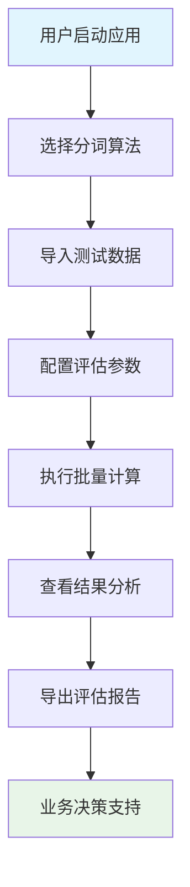

# Cer-MatchingTools-V1-需求规格说明书

## 1. 引言

### 1.1 编写目的
本文档从用户业务视角描述ASR字准确率对比工具的需求规格，采用业务垂直切片法，以用户角色和业务流程为主线，为产品设计和开发提供依据。

### 1.2 项目背景
随着自动语音识别（ASR）技术在教育、医疗、客服等领域的广泛应用，语音识别质量评估成为关键环节。本项目旨在为不同行业的专业用户提供一个直观、准确、高效的中文字准确率（CER）评估工具。

### 1.3 产品定位
**一站式ASR质量评估平台**，为语音技术从业者提供从数据导入到结果分析的完整业务解决方案。

## 2. 用户角色与业务场景

### 2.1 主要用户角色

#### 2.1.1 🎓 语音识别研究员（学术型用户）
**角色特征**：
- 需要对比不同ASR模型的性能
- 注重实验结果的科学性和可重复性
- 需要详细的错误分析和统计数据

**业务目标**：
- 评估和改进ASR算法
- 发表学术论文和研究报告
- 建立标准化的评估流程

#### 2.1.2 🔧 语音技术开发者（工程型用户）
**角色特征**：
- 需要快速验证ASR系统的准确率
- 注重工具的易用性和处理效率
- 需要批量处理大量测试数据

**业务目标**：
- 产品质量控制
- 系统性能优化
- 客户交付验收

#### 2.1.3 📊 质量评估专员（业务型用户）
**角色特征**：
- 负责ASR产品的质量把控
- 需要生成标准化的评估报告
- 注重结果的可视化和易理解性

**业务目标**：
- 制定质量标准
- 输出评估报告
- 支持商务决策

#### 2.1.4 🏢 企业决策者（管理型用户）
**角色特征**：
- 关注ASR技术的商业价值
- 需要清晰的投资回报分析
- 重视技术选型的客观依据

**业务目标**：
- 技术选型决策
- 供应商评估
- 投资效果评价

## 3. 核心业务流程

### 3.1 端到端业务流程图

### 3.2 业务场景详述

#### 3.2.1 📋 场景一：新ASR模型性能评估
**业务背景**：研究员开发了新的ASR模型，需要与现有模型进行准确率对比

**用户故事**：
> 作为一名语音识别研究员，我希望能够快速对比我的新模型与baseline模型的字准确率，以便评估改进效果和决定是否采用新模型。

**业务流程**：
1. **数据准备阶段**
   - 准备标准测试集（参考文本）
   - 获取两个模型的转写结果文件
   - 确保数据格式一致性

2. **工具配置阶段**
   - 选择适合的分词算法（如HanLP用于学术精度）
   - 配置语气词过滤策略
   - 设置批量处理参数

3. **评估执行阶段**
   - 批量导入文件对
   - 执行并行计算
   - 实时查看处理进度

4. **结果分析阶段**
   - 对比两个模型的CER指标
   - 分析错误类型分布
   - 识别改进方向

5. **报告输出阶段**
   - 生成详细的评估报告
   - 导出数据用于论文撰写
   - 分享结果给团队成员

**成功标准**：
- ✅ 能够准确计算字符错误率，误差小于0.1%
- ✅ 处理1000个文件对在5分钟内完成
- ✅ 生成包含统计分析的详细报告

#### 3.2.2 🏭 场景二：生产环境质量监控
**业务背景**：企业部署的ASR系统需要定期质量评估，确保服务稳定性

**用户故事**：
> 作为质量评估专员，我需要每周对生产环境的ASR系统进行准确率检查，及时发现质量下降趋势，保障客户服务质量。

**业务流程**：
1. **定期数据收集**
   - 从生产环境获取ASR转写结果
   - 收集对应的人工标注数据
   - 建立时间序列数据集

2. **标准化评估**
   - 使用统一的分词策略（如Jieba保证一致性）
   - 应用相同的过滤规则
   - 执行批量质量检查

3. **趋势分析**
   - 对比历史数据找出变化趋势
   - 识别质量异常点
   - 分析可能的原因

4. **预警和报告**
   - 生成质量监控仪表板
   - 在质量下降时发出预警
   - 向管理层提供定期报告

**成功标准**：
- ✅ 实现自动化的周期性评估
- ✅ 提供清晰的质量趋势可视化
- ✅ 及时发现和预警质量问题

#### 3.2.3 🎯 场景三：技术选型对比分析
**业务背景**：企业需要在多个ASR供应商中选择最适合的解决方案

**用户故事**：
> 作为技术决策者，我需要对三家ASR供应商的产品进行客观的准确率测试，为采购决策提供数据支持。

**业务流程**：
1. **测试环境搭建**
   - 准备标准化的测试数据集
   - 收集各供应商的转写结果
   - 确保测试条件的公平性

2. **多维度对比**
   - 使用不同分词算法验证结果一致性
   - 分析不同场景下的表现差异
   - 评估特定领域的专业性

3. **成本效益分析**
   - 结合准确率和成本进行分析
   - 考虑实施复杂度和风险
   - 评估长期维护成本

4. **决策支持**
   - 生成供应商对比报告
   - 提供推荐方案和理由
   - 支持合同谈判

**成功标准**：
- ✅ 提供客观公正的对比数据
- ✅ 支持多维度的决策分析
- ✅ 生成专业的供应商评估报告

## 4. 用户体验需求

### 4.1 易用性需求

#### 4.1.1 直观的工作流程
**需求描述**：用户能够在5分钟内掌握基本操作流程
**设计原则**：
- 🎯 向导式引导：通过界面布局清晰指示操作顺序
- 🔄 即时反馈：每个操作都有明确的状态提示
- 🛡️ 错误预防：在用户犯错前提供友好提示

#### 4.1.2 灵活的数据处理
**需求描述**：支持多种数据导入方式和格式
**设计原则**：
- 📁 拖拽导入：支持文件拖拽和批量选择
- 🔄 智能配对：自动或手动建立文件对应关系
- 📊 进度可视：清晰显示处理进度和剩余时间

### 4.2 专业性需求

#### 4.2.1 算法选择灵活性
**需求描述**：根据不同场景选择最适合的分词算法
**设计原则**：
- 🧠 智能推荐：根据用户角色推荐最佳算法
- ⚖️ 性能对比：显示不同算法的特点和适用场景
- 🔧 专家模式：为高级用户提供详细配置选项

#### 4.2.2 结果分析深度
**需求描述**：提供多层次的结果分析和可视化
**设计原则**：
- 📊 分层展示：从总体到详细的多层次信息
- 🎨 可视化：图表化展示错误分布和统计信息
- 📋 导出灵活：支持多种格式的结果导出

### 4.3 可靠性需求

#### 4.3.1 数据安全保障
**需求描述**：确保用户数据的安全和隐私
**设计原则**：
- 🔒 本地处理：所有数据在本地处理，不上传云端
- 🗑️ 安全清理：临时文件的自动清理机制
- 🛡️ 权限控制：合理的文件访问权限设置

#### 4.3.2 系统稳定性
**需求描述**：在各种异常情况下保持系统稳定运行
**设计原则**：
- 🔄 优雅降级：分词器不可用时的备选方案
- ⚡ 错误恢复：自动恢复机制和错误重试
- 📝 日志记录：详细的操作日志和错误追踪

## 5. 业务价值与指标

### 5.1 用户价值

#### 5.1.1 效率提升
- **量化指标**：相比人工评估，效率提升90%以上
- **业务价值**：研究员可以将更多时间投入算法优化
- **成本节约**：减少重复性工作的人力成本

#### 5.1.2 决策支持
- **量化指标**：提供准确率数据支持技术选型
- **业务价值**：降低技术决策风险
- **竞争优势**：基于数据的客观决策

#### 5.1.3 标准化流程
- **量化指标**：建立统一的评估标准和流程
- **业务价值**：提高评估结果的可比性和可重复性
- **质量保证**：确保ASR产品质量的一致性

### 5.2 业务成功指标

#### 5.2.1 用户满意度指标
- 📊 **用户留存率** > 90%（月度）
- ⭐ **用户满意度** > 4.5/5.0
- 🔄 **重复使用率** > 80%

#### 5.2.2 功能使用指标
- ⚡ **任务完成率** > 95%
- ⏱️ **平均使用时长** < 10分钟（单次任务）
- 🎯 **功能覆盖率** > 85%（用户使用核心功能比例）

#### 5.2.3 技术性能指标
- 🚀 **响应时间** < 1秒（单文件处理）
- 💾 **内存占用** < 512MB
- 🔄 **并发处理** > 100文件对/批次

## 6. 业务约束与风险

### 6.1 业务约束

#### 6.1.1 使用场景约束
- **用户群体**：主要面向专业技术人员
- **数据规模**：单批次处理不超过1000个文件对
- **使用频率**：主要用于项目节点性评估，非日常高频使用

#### 6.1.2 技术环境约束
- **平台要求**：支持主流桌面操作系统
- **网络依赖**：仅模型下载时需要网络连接
- **硬件要求**：普通办公电脑即可运行

### 6.2 业务风险

#### 6.2.1 用户接受度风险
- **风险描述**：专业用户可能有特定的工作习惯
- **缓解措施**：提供灵活的配置选项和导入导出功能
- **监控指标**：用户反馈和使用数据分析

#### 6.2.2 技术演进风险
- **风险描述**：ASR技术快速发展可能要求工具升级
- **缓解措施**：采用可扩展的架构设计
- **监控指标**：技术趋势跟踪和用户需求变化

## 7. 后续发展规划

### 7.1 短期优化（3-6个月）
- 🔧 增加更多分词算法支持
- 📊 优化结果可视化展示
- 🚀 提升批量处理性能

### 7.2 中期扩展（6-12个月）
- 🌐 增加Web版本支持
- 📱 开发移动端应用
- 🤖 集成AI辅助分析功能

### 7.3 长期愿景（1-2年）
- ☁️ 提供云端协作功能
- 🔗 与主流ASR平台集成
- 🌍 支持多语言评估

---

**文档版本**：V1.3  
**最后更新时间**：2025-10-23 14:58  
**更新说明**：[P2任务完成：增强系统响应性和用户体验，实现异步处理和任务控制功能]  
**审核人员**：开发团队  
**批准人员**：项目负责人 